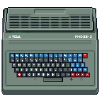

# GPMD85Emulator
Open-source, multi-platform emulator of the Tesla PMD 85,
an 8-bit personal microcomputer produced in 1980s in former Czechoslovakia

> Notice: GPMD85Emulator is not intended to be built and run on Microsoft Windows,
> because there is a much better and more feature-rich emulator,
> made specifically for this platform.<br />
> Visit https://pmd85.borik.net/wiki/Emulator

## AUTHORS & LICENSE
- for complete list of contributors and their roles, see [AUTHORS.md](AUTHORS.md)
- project is open-sourced under the terms specified in [LICENSE.md](LICENSE.md)

## REQUIRED SYSTEM LIBRARIES:
- **SDL2 - Simple DirectMedia Library** _(v2.0.x)_
- **OpenGL - Open Graphics Library** _(v2.1 or higher)_

## INCORPORATED LIBRARIES:
- **SAASound** by Dave Hooper & Simon Owen,
  [see license](https://github.com/stripwax/SAASound/blob/master/LICENCE)
- **Dear ImGui** by Omar Cornut,
  [see license](https://github.com/ocornut/imgui/blob/master/LICENSE.txt)
- **sigslot** by Pierre-Antoine Lacaze,
  [see source](https://github.com/palacaze/sigslot/blob/master/LICENSE)

## HOTKEYS:
- function `[f]` keys are any of Alt, Win, Mac or Meta keys
- e.g. for start/stop of tape emulator, use `[f]+P` hotkey

## INSTALLATION:
- check [installation guide](INSTALL.md) for prerequisites
```bash
# clone with all submodules:
git clone --recurse-submodules [url]
# generate configuration scripts with autotools
autoreconf -vfi
# configure and build
./configure
make
# (optional) install into system dirs
sudo make install
```

## CONFIGURATION PARAMETERS:
- to enable debug mode, use `./configure --enable-debug`
- to disable all trace messages, use `./configure --disable-trace` (size optimization)

## COMMAND-LINE ARGUMENTS:
| short / full form of argument    | meaning |
| :--- | :--- |
| `-h`, `--help`                   | print this help |
| `-v`, `--version`                | print version number |
| `-c`, `--over-cfg`               | override user's configuration |
| `-m`, `--machine {X}`            | select machine (`1`, `2`, `2A`, `3`, `C2717`, `Alfa`, `Alfa2`, `Mato`) |
| `-r`, `--rmm`                    | connect ROM module |
| `-mrm`, `--megarom`              | mega ROM module image |
| `-sc`, `--scaler {1..5}`         | screen size multiplier |
| `-bd`, `--border {0..9}`         | screen border width |
| `-hp`, `--halfpass {0..5}`       | scanliner (`0`=NONE, `1-4`=HALFPASS, `5`=LCD) |
| `-cp`, `--profile {0..3}`        | color profile (`0`=MONO, `1`=STD, `2`=RGB, `3`=ColorACE) |
| `-vol`, `--volume {0..127}`      | sound volume (`0`=MUTE) |
| `-mif`, `--mif85`                | connect MIF 85 music interface |
| `-p`, `--pmd32`                  | connect PMD 32 disk interface |
| `-drA`, `--drive-a "file"`       | drive A disk image (`.p32`) |
| `-dwA`, `--drive-a-write`        | drive A write enabled |
| `-drB`, `--drive-b "file"`       | drive B disk image (`.p32`) |
| `-dwB`, `--drive-b-write`        | drive B write enabled |
| `-drC`, `--drive-c "file"`       | drive C disk image (`.p32`) |
| `-dwC`, `--drive-c-write`        | drive C write enabled |
| `-drD`, `--drive-d "file"`       | drive D disk image (`.p32`) |
| `-dwD`, `--drive-d-write`        | drive D write enabled |
| `-t`, `--tape "file"`            | tape image (`.ptp`) |
| `-trs`, `--tape-real`            | real tape speed |
| `-s`, `--snap "file"`            | load snapshot (`.psn`) |
| `-b`, `--memblock "file"`        | load memory block (`.bin`) |
| `-ptr`, `--memblock-address {W}` | load memory block at given address |
